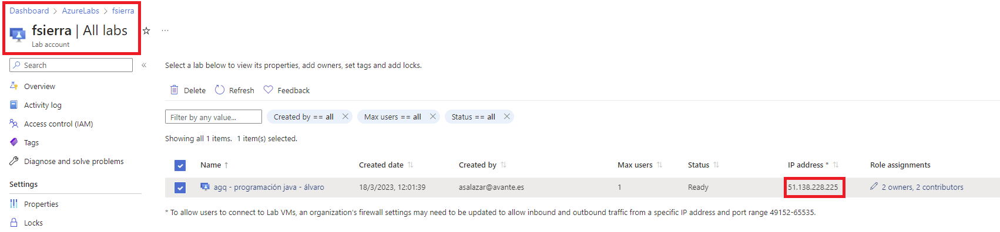

# ConfiguracionFirewallParaAzureLabs

Dado que Azure Lab Services se ejecuta en la nube pública, es posible que se necesite una configuración adicional para permitir a los estudiantes obtener acceso a su máquina virtual.

Cada laboratorio usa ***una sola*** dirección IP pública y ***varios*** puertos. 

## Si se usa una cuenta de laboratorio.

Esta es la opción actualmente usada por la cuenta de laboratorio ***fsierra***.

Cada laboratorio usa una sola dirección IP pública y varios puertos. Todas las máquinas virtuales, tanto la plantilla de máquina virtual como las máquinas virtuales de estudiantes, ***usarán esta dirección IP pública***. La dirección IP pública no cambiará durante la vida del laboratorio. Cada máquina virtual tendrá un número de puerto diferente. El rango de los números de puerto es ***49152 - 65535***. 

## Si se usa un plan de laboratorio.

Todas las máquinas virtuales, tanto la plantilla de máquina virtual como las máquinas virtuales de estudiantes, ***usarán esta dirección IP pública***. La dirección IP pública no cambiará durante la vida del laboratorio. 

Cada máquina virtual tendrá un ***número de puerto diferente***. 

Los intervalos de puertos para las conexiones ***SSH*** son ***4980-4989*** y ***5000-6999***. 

Los intervalos de puertos para las conexiones ***RDP*** son ***4990-4999*** y ***7000-8999***. 


Para saber la IP pública del laboratorio, usamos el portal.



Para comunicar al cliente es mejor dar la ***IP*** que la DNS que genera Azure, que es de la forma ***ml-lab-b41bd8c5-fc48-48a4-8cfa-69afb4b660ff.northeurope.cloudapp.azure.com***, si se intenta escribir manualmente será un problema.

Por consiguiente, es imperativo crear esas reglas en el FW del cliente para que puedan acceder a los labs.

## Plantilla para notificar a los clientes (Versión cuenta de laboratorio)

Se puede enviar un correo con el siguiente contenido.

```
Cada laboratorio usa una sola dirección IP pública y varios puertos. Todas las máquinas virtuales de estudiantes usarán esta dirección IP pública. La dirección IP pública no cambiará durante la vida del laboratorio. Cada máquina virtual tendrá un número de puerto diferente asignado por el proveedor de laboratorio. 

En consecuencia, los alumnos desde sus equipos deberán poder conectar usando el protocolo RDP a la dirección IP ***<Poner aquí la IP>*** a los puertos de destino del rango 49152-65535

Les rogamos que se pongan en contacto con nosotros en fechas previas al inicio de la acción formativa para verificar la correcta conexión desde sus instalaciones.
```
